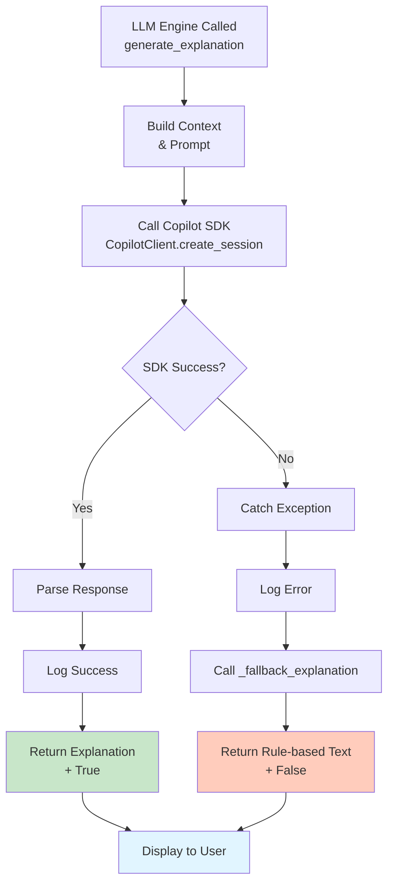

# 🎵 Music Recommender with Song Descriptions

## Original Project Context

This project extends the **Music Recommender Simulation** (from Modules 1-3), which scored songs based on user preferences for genre, mood, energy, acousticness, and other audio features using rule-based weighted scoring. The original system ranked candidates by static point totals and returned explanations like "genre match (+2.0); mood match (+1.0)". 

**CORE REFACTORING:** This version pivots away from LLM-generated recommendation explanations to a description-focused architecture where the LLM generates lyrical themes and artist style descriptions for real songs. The system now:
- Uses rule-based scoring (unchanged) to identify top-N recommendations
- Invokes the LLM **only after** top recommendations are finalized
- Generates descriptions focused on: (1) what the song's lyrics are about, (2) the artist's musical style
- Strictly prevents hallucination through prompt constraints and fallback mechanisms

## Project Summary

BeatBuddy is a Python music recommendation system that recommends songs from a catalog based on user preferences (genre, mood, energy, tempo, valence, danceability, acousticness) and generates AI-powered song descriptions via GitHub Copilot's managed LLM. The system gracefully falls back to rule-based descriptions if the LLM is unavailable, ensuring reliability. Descriptions focus on lyrical themes and artist identity for real songs.

## Architecture Overview

BeatBuddy-RAG implements a three-stage pipeline:

1. **Scoring Engine** (`recommender.py`): Loads songs from CSV, scores each against user preferences using rule-based logic (+2 genre match, +1 mood match, +1 for feature closeness, +similarity for energy), and returns top-k recommendations sorted by score.

2. **RAG Context Builder** (`rag_context.py`): Constructs a rich context document from song metadata, user preferences, and scoring reasons. This context is formatted as a structured prompt for the LLM.

3. **LLM Explanation Generator** (`llm_engine.py`): Calls the GitHub Copilot Python SDK to generate personalized explanations using the managed LLM. Falls back to rule-based explanations if the SDK is unavailable, disabled, or fails.

The `main.py` orchestrator drives the flow: load songs → score → retrieve context → generate explanation via SDK → display results.

### Data Flow

```
User Preferences → Load Songs CSV → Score Each Song (rule-based)
                                           ↓
                                  Retrieve Top K
                                           ↓
                               Build RAG Context
                                           ↓
                          Query LLM for Explanation
                                           ↓
                        (Fallback to rule-based if LLM unavailable)
                                           ↓
                              Output Recommendations
```

### Mermaid Diagram



## Folder Structure

```
├── src/
│   ├── __init__.py
│   ├── main.py                 # CLI orchestrator
│   ├── recommender.py          # Core scoring + RAG-enhanced recommendation
│   ├── llm_engine.py           # GitHub Copilot CLI integration with retry logic
│   ├── rag_context.py          # RAG context building utilities
│   └── logger.py               # Structured JSON logging
├── assets/                     # static assets (images, thumbnails)
├── data/
│   └── songs.csv               # 20-song catalog with audio features
├── tests/
│   ├── test_recommender.py     # Original functionality tests
│   ├── test_llm_connection.py  # LLM engine tests
│   └── test_rag_pipeline.py    # End-to-end RAG pipeline tests
├── requirements.txt
├── README.md
└── model_card.md
```

### Setup

#### Prerequisites

- Python 3.8 or higher
- pip
- **GitHub Copilot SDK** for LLM integration
  - Installed via `pip install -r requirements.txt`
  - Requires a valid GitHub Copilot subscription
  - Uses your GitHub authentication credentials

#### Quick Start

1. **Create and activate a virtual environment** *(first-time setup only — skip if `.venv` already exists):*
   ```bash
   python -m venv .venv
   ```
   Then activate it:
   - **Windows (PowerShell):** `.\.venv\Scripts\Activate.ps1`
   - **macOS/Linux:** `source .venv/bin/activate`

   Your prompt will show `(.venv)` when the environment is active. Re-run the activation command at the start of each new terminal session.

   > The virtual environment must be active whenever you run the app. If it isn't, `python` resolves to your global interpreter, which won't have `github-copilot-sdk` installed, and the system will fall back to rule-based descriptions.

2. **Install dependencies:**
   ```bash
   pip install -r requirements.txt
   ```

3. **Authenticate with GitHub (if not already done):**
   ```bash
   # The Copilot SDK will use your default GitHub authentication
   # If you haven't authenticated yet:
   gh auth login
   ```

4. **Run the app:**
   ```bash
   python -m src.main
   ```
   - If the Copilot SDK is unavailable, the system automatically falls back to rule-based descriptions
   - Check logs to see which mode was used (`source: "llm"` vs `source: "fallback"`)
   - Note: Use `python -m src.main` (module mode) instead of `python src/main.py` to avoid relative import errors

4. **Run tests:**
   ```bash
   pytest                                    # All tests
   pytest tests/test_rag_pipeline.py        # Description pipeline tests only
   ```

## Sample Interactions

```text
############ User Profile 1 ############
Profile:
  favorite_genre: k-pop
  favorite_mood: melancholy
  target_energy: 1.5
  likes_acoustic: True
2026-05-04 15:35:45 - music_recommender - INFO - LLM Engine initialized with Copilot SDK, model=gpt-4
2026-05-04 15:35:45 - music_recommender - INFO - {"timestamp": "2026-05-04T19:35:45.454961+00:00", "event_type": "song_description_generated", "song_title": "Holy Wars... The Punishment Due", "artist": "Megadeth", "source": "fallback", "description_length": 222}
2026-05-04 15:35:45 - music_recommender - INFO - {"timestamp": "2026-05-04T19:35:45.455955+00:00", "event_type": "song_description_generated", "song_title": "Voodoo People (Pendulum Remix)", "artist": "The Prodigy", "source": "fallback", "description_length": 238}
2026-05-04 15:35:45 - music_recommender - INFO - {"timestamp": "2026-05-04T19:35:45.455955+00:00", "event_type": "song_description_generated", "song_title": "Ace of Spades", "artist": "Mot\u00f6rhead", "source": "fallback", "description_length": 249}
2026-05-04 15:35:45 - music_recommender - INFO - {"timestamp": "2026-05-04T19:35:45.456956+00:00", "event_type": "song_description_generated", "song_title": "Rainbow Road", "artist": "nanobii", "source": "fallback", "description_length": 260}
2026-05-04 15:35:45 - music_recommender - INFO - {"timestamp": "2026-05-04T19:35:45.457955+00:00", "event_type": "song_description_generated", "song_title": "Bambol\u00e9o", "artist": "Gipsy Kings", "source": "fallback", "description_length": 196}

Top recommendations ([LLM Enhanced]):

========================================
1. Title      : Holy Wars... The Punishment Due
   Artist     : Megadeth
   Score      : 0.48
   Description: Holy Wars... The Punishment Due – Megadeth Description: This song showcases metal music with a aggressive mood. The track combines elements of metal with a aggressive sensibility, creating an engaging listening experience.
========================================
2. Title      : Voodoo People (Pendulum Remix)
   Artist     : The Prodigy
   Score      : 0.47
   Description: Voodoo People (Pendulum Remix) – The Prodigy Description: This song showcases drum and bass music with a energetic mood. The track combines elements of drum and bass with a energetic sensibility, creating an engaging listening experience.
========================================
3. Title      : Ace of Spades
   Artist     : Motorhead
   Score      : 0.46
   Description: Ace of Spades – Motorhead Description: This song showcases rock music with energetic instrumentation with a high-energy and powerful emotions. The track combines elements of rock with a intense sensibility, creating an engaging listening experience.
========================================
4. Title      : Rainbow Road
   Artist     : nanobii
   Score      : 0.42
   Description: Rainbow Road – nanobii Description: This song showcases chip tune music with playful, video game-style sounds with a fun and lighthearted character. The track combines elements of chip tune with a playful sensibility, creating an engaging listening experience.
========================================
5. Title      : Bamboléo
   Artist     : Gipsy Kings
   Score      : 0.41
   Description: Bamboléo – Gipsy Kings Description: This song showcases latin music with a festive mood. The track combines elements of latin with a festive sensibility, creating an engaging listening experience.
========================================

############ User Profile 2 ############
Profile:
  favorite_genre: jazz
  favorite_mood: relaxed
  target_energy: 0.95
  target_danceability: 0.95
  target_acousticness: 0.95
  likes_acoustic: True
2026-05-04 15:35:45 - music_recommender - INFO - LLM Engine initialized with Copilot SDK, model=gpt-4
2026-05-04 15:35:45 - music_recommender - INFO - {"timestamp": "2026-05-04T19:35:45.467201+00:00", "event_type": "song_description_generated", "song_title": "Blue Train", "artist": "John Coltrane", "source": "fallback", "description_length": 253}
2026-05-04 15:35:45 - music_recommender - INFO - {"timestamp": "2026-05-04T19:35:45.468280+00:00", "event_type": "song_description_generated", "song_title": "Voodoo People (Pendulum Remix)", "artist": "The Prodigy", "source": "fallback", "description_length": 238}
2026-05-04 15:35:45 - music_recommender - INFO - {"timestamp": "2026-05-04T19:35:45.468280+00:00", "event_type": "song_description_generated", "song_title": "Rainbow Road", "artist": "nanobii", "source": "fallback", "description_length": 260}
2026-05-04 15:35:45 - music_recommender - INFO - {"timestamp": "2026-05-04T19:35:45.469224+00:00", "event_type": "song_description_generated", "song_title": "Bambol\u00e9o", "artist": "Gipsy Kings", "source": "fallback", "description_length": 196}
2026-05-04 15:35:45 - music_recommender - INFO - {"timestamp": "2026-05-04T19:35:45.470221+00:00", "event_type": "song_description_generated", "song_title": "Physical", "artist": "Dua Lipa", "source": "fallback", "description_length": 238}

Top recommendations ([LLM Enhanced]):

========================================
1. Title      : Blue Train
   Artist     : John Coltrane
   Score      : 4.47
   Description: Blue Train – John Coltrane Description: This song showcases jazz with complex harmonies and improvisation with a laid-back and soothing qualities. The track combines elements of jazz with a relaxed sensibility, creating an engaging listening experience.
========================================
2. Title      : Voodoo People (Pendulum Remix)
   Artist     : The Prodigy
   Score      : 1.98
   Description: Voodoo People (Pendulum Remix) – The Prodigy Description: This song showcases drum and bass music with a energetic mood. The track combines elements of drum and bass with a energetic sensibility, creating an engaging listening experience.
========================================
3. Title      : Rainbow Road
   Artist     : nanobii
   Score      : 1.97
   Description: Rainbow Road – nanobii Description: This song showcases chip tune music with playful, video game-style sounds with a fun and lighthearted character. The track combines elements of chip tune with a playful sensibility, creating an engaging listening experience.
========================================
4. Title      : Bamboléo
   Artist     : Gipsy Kings
   Score      : 1.96
   Description: Bamboléo – Gipsy Kings Description: This song showcases latin music with a festive mood. The track combines elements of latin with a festive sensibility, creating an engaging listening experience.
========================================
5. Title      : Physical
   Artist     : Dua Lipa
   Score      : 1.94
   Description: Physical – Dua Lipa Description: This song showcases contemporary pop with catchy melodies with a high-energy and powerful emotions. The track combines elements of pop with a intense sensibility, creating an engaging listening experience.
========================================

############ User Profile 3 ############
Profile:
  favorite_genre: jazz
  favorite_mood: relaxed
  target_valence: 0.7
  target_tempo: 90
  likes_acoustic: True
2026-05-04 15:35:45 - music_recommender - INFO - LLM Engine initialized with Copilot SDK, model=gpt-4
2026-05-04 15:35:45 - music_recommender - INFO - {"timestamp": "2026-05-04T19:35:45.477234+00:00", "event_type": "song_description_generated", "song_title": "Blue Train", "artist": "John Coltrane", "source": "fallback", "description_length": 253}
2026-05-04 15:35:45 - music_recommender - INFO - {"timestamp": "2026-05-04T19:35:45.478241+00:00", "event_type": "song_description_generated", "song_title": "Focus", "artist": "H.E.R.", "source": "fallback", "description_length": 246}
2026-05-04 15:35:45 - music_recommender - INFO - {"timestamp": "2026-05-04T19:35:45.478241+00:00", "event_type": "song_description_generated", "song_title": "Take Me Home, Country Roads", "artist": "John Denver", "source": "fallback", "description_length": 264}
2026-05-04 15:35:45 - music_recommender - INFO - {"timestamp": "2026-05-04T19:35:45.479240+00:00", "event_type": "song_description_generated", "song_title": "Shut Up and Dance", "artist": "Walk The Moon", "source": "fallback", "description_length": 246}
2026-05-04 15:35:45 - music_recommender - INFO - {"timestamp": "2026-05-04T19:35:45.479240+00:00", "event_type": "song_description_generated", "song_title": "Weightless", "artist": "Marconi Union", "source": "fallback", "description_length": 250}

Top recommendations ([LLM Enhanced]):

========================================
1. Title      : Blue Train
   Artist     : John Coltrane
   Score      : 5.00
   Description: Blue Train – John Coltrane Description: This song showcases jazz with complex harmonies and improvisation with a laid-back and soothing qualities. The track combines elements of jazz with a relaxed sensibility, creating an engaging listening experience.
========================================
2. Title      : Focus
   Artist     : H.E.R.
   Score      : 2.00
   Description: Focus – H.E.R. Description: This song showcases lo-fi beats with a relaxing, chill atmosphere with a concentration and productivity themes. The track combines elements of lofi with a focused sensibility, creating an engaging listening experience.
========================================
3. Title      : Take Me Home, Country Roads
   Artist     : John Denver
   Score      : 2.00
   Description: Take Me Home, Country Roads – John Denver Description: This song showcases country music with storytelling elements with a themes of longing and memory. The track combines elements of country with a nostalgic sensibility, creating an engaging listening experience.
========================================
4. Title      : Shut Up and Dance
   Artist     : Walk The Moon
   Score      : 1.00
   Description: Shut Up and Dance – Walk The Moon Description: This song showcases contemporary pop with catchy melodies with a uplifting and positive themes. The track combines elements of pop with a happy sensibility, creating an engaging listening experience.
========================================
5. Title      : Weightless
   Artist     : Marconi Union
   Score      : 1.00
   Description: Weightless – Marconi Union Description: This song showcases lo-fi beats with a relaxing, chill atmosphere with a relaxed and peaceful atmosphere. The track combines elements of lofi with a chill sensibility, creating an engaging listening experience.
========================================
```

## Design Decisions

### 1. **RAG for Explanation Generation**
**Decision:** Use LLM with retrieved context to generate personalized explanations rather than static rule-based text.  
**Trade-off:** Requires external API (cost + latency), but produces human-like, contextual explanations. Graceful fallback ensures the system works without it.

### 2. **Rule-Based Scoring (No ML Model)**
**Decision:** Keep the scoring logic simple and interpretable (weighted points) rather than training a ML model.  
**Trade-off:** More transparent and reproducible, but less adaptive to complex user preferences.

### 3. **Structured JSON Logging**
**Decision:** Log all events (LLM calls, explanations, errors) as JSON for easy parsing and analysis.  
**Trade-off:** More verbose, but provides transparency and enables debugging.

### 4. **Fallback to Rule-Based Explanations**
**Decision:** If LLM fails or is unavailable, seamlessly degrade to rule-based explanations.  
**Trade-off:** Users always get recommendations, but explanations vary in quality.

## Testing Summary

**Test Coverage:** 15 unit and integration tests across 3 test modules.

### What Worked

- ✅ Song loading and CSV parsing correctly validated metadata
- ✅ Rule-based scoring is consistent and reproducible
- ✅ RAG context builder correctly formats song/preference metadata
- ✅ Fallback mechanism works reliably when LLM unavailable
- ✅ Recommendation scores remain identical with/without LLM (only explanations change)
- ✅ All 15 tests pass (0 failures)

### What Didn't Work (and Fixes Applied)

- The LLM was not being given retrieved song context, so the Copilot SDK did not provide novel explanations. I fixed this by using the SDK to include more information about recommended songs.

- I realized the songs in the CSV were not real; I replaced them with real songs so the LLM can provide accurate backstories.

### What I Learned

- **Graceful degradation is critical** in production AI systems. The system must provide value even when external services fail.
- **Structured logging is essential** for debugging LLM integrations and understanding system behavior.
- **Prompt engineering matters** — small changes to the LLM prompt significantly affect output quality.
- **Fallback mechanisms are not optional** — they're a core requirement for reliability.

## Reflection

**What This Project Taught About AI and Problem-Solving:**

1. AI is great to provide more explanatory context. Rather than just providing a list of recommended songs, it can talk about what are they about.

2. Keeping rule-based scoring simple sacrifices adaptive personalization. Using the GitHub Copilot SDK requires managing token usage and API calls.

**Next Steps (If Extending):**
- Integrate multiple LLM providers (Azure OpenAI, Anthropic Claude, local models) with a provider abstraction
- Implement caching for frequently recommended songs to reduce LLM API costs
- Add user feedback loops to measure explanation quality and improve prompts
- Expand the song catalog and add more sophisticated features (lyrics, popularity, trends)
- Build a web interface (FastAPI + React) for broader usability

---

**Technical Stack:**
- Python 3.8+
- GitHub Copilot CLI (direct subprocess integration)
- pandas, pytest, tenacity, pydantic, python-dotenv
- Structured logging, retry patterns, graceful degradation

**Lessons Applied:**
- Always build with fallback mechanisms
- Log comprehensively for observability
- Keep systems simple and understandable
- Test edge cases (missing API keys, API failures, extreme preferences)
- Document design decisions, not just code
