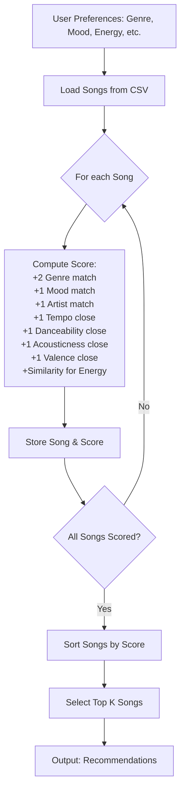

# 🎵 Music Recommender Simulation with RAG Enhancement

## Project Summary

This is a music recommender system enhanced with **Retrieval-Augmented Generation (RAG)** for learning and experimentation. It suggests songs from a catalog based on user preferences (genre, mood, energy, etc.) and uses an LLM to generate personalized, natural-language explanations for recommendations.

**New RAG Feature:** The system retrieves song metadata and user preferences to provide rich context to an LLM, which then generates unique, contextual explanations instead of static, rule-based reasons. The system gracefully falls back to rule-based explanations if the LLM is unavailable.

---

## How The System Works

### Core Recommendation Engine

This recommender scores each song with simple, rule-based points and then returns the top results. There is no Gaussian weighting or learned model.

Each `Song` uses these features: energy, tempo_bpm, valence, danceability, acousticness, genre, and mood.

Each user profile provides a favorite genre and mood, plus target values for numeric features like energy, tempo, valence, danceability, and acousticness. Favorite artist is optional, and any missing targets are simply skipped.

The score adds:
- +2 for genre match
- +1 for mood match
- +1 for artist match (if provided)
- +1 each when tempo, danceability, acousticness, or valence are within a threshold
- an energy similarity bonus of $1 - |energy - target|$

Songs are sorted by score, and the top $k$ are recommended.

---

**What features does each Song use?**
- genre, mood, artist, energy, tempo_bpm, valence, danceability, acousticness

**What information does your UserProfile store?**
- favorite genre, favorite mood, favorite artist (optional), target energy, target tempo, target valence, target danceability, target acousticness, number of recommendations wanted

**How does your Recommender compute a score for each song?**
- For each song, add points for matching genre (+2), mood (+1), artist (+1), and for being close to the user's targets for energy, tempo, valence, danceability, and acousticness (+1 each if within a threshold). Add a similarity score for energy (1 - absolute difference).

**How do you choose which songs to recommend?**
- After scoring all songs, sort them by score and recommend the top K songs as requested by the user.

---

**Data Flow Diagram (Mermaid.js):**



---

**Potential Bias Note:**  
This system might over-prioritize genre, so it could ignore great songs that match the user's mood or other preferences but are in a different genre. It may also favor songs with features close to the user's targets, even if those features are less important to the user.

---

## RAG Enhancement (New!)

### What is RAG?

**Retrieval-Augmented Generation (RAG)** combines information retrieval with LLM-powered generation. The system:

1. **Retrieves** relevant data (song metadata, user preferences, matching reasons)
2. **Augments** the LLM prompt with this context
3. **Generates** personalized explanations using natural language

### How It Works in This Project

For each recommended song, the system:
1. Builds a RAG context with song features, user preferences, and match analysis
2. Sends this context to an LLM (OpenAI or compatible API)
3. The LLM generates a personalized explanation
4. Falls back to rule-based explanations if LLM unavailable or fails

**Example Output:**

- **Rule-Based:** `genre match (+2.0); mood match (+1.0); energy similarity (+0.42)`
- **RAG-Enhanced:** `We picked 'Coffee Shop Stories' because it matches your love of jazz and relaxed vibes—the smooth acousticness (0.89) and moderate tempo (90 BPM) create the perfect focus music`

### Benefits

✅ **More Natural:** LLM-generated explanations read like a human recommendation
✅ **Contextual:** Each explanation is tailored to the specific song and user
✅ **Reliable:** Falls back gracefully if LLM unavailable
✅ **Transparent:** All LLM calls are logged for debugging

---


Example output from the CLI simulation:


---

#### Individual User Profile Outputs

**User Profile 1**  
Impossible match: genre and mood not in dataset, extreme energy


**User Profile 2**  
Contradictory: likes acoustic but wants high energy and danceability


**User Profile 3**  
Prefers jazz, relaxed mood, high valence, moderate tempo, and acoustic music


## Getting Started

### Setup

1. Create a virtual environment (optional but recommended):

   ```bash
   python -m venv .venv
   source .venv/bin/activate      # Mac or Linux
   .venv\Scripts\activate         # Windows

2. Install dependencies

```bash
pip install -r requirements.txt
```

3. **(Optional) Configure LLM for RAG Enhancement**

   To enable LLM-powered explanations, set up your API credentials:

   **Option A: OpenAI API**
   ```bash
   export OPENAI_API_KEY="sk-..."      # Mac/Linux
   set OPENAI_API_KEY=sk-...           # Windows
   ```

   **Option B: Azure OpenAI or Custom Endpoint**
   ```bash
   export OPENAI_API_KEY="..."
   export OPENAI_BASE_URL="https://..."
   ```

   If no API key is set, the system falls back to rule-based explanations automatically.

4. Run the app:

```bash
python -m src.main
```

The output will indicate whether LLM explanations are being generated or using fallback.

### Running Tests

Run all tests:
```bash
pytest
```

Run specific test suites:
```bash
pytest tests/test_recommender.py          # Original functionality
pytest tests/test_llm_connection.py       # LLM integration
pytest tests/test_rag_pipeline.py         # End-to-end RAG pipeline
```

---

## Experiments You Tried


### What happened when you changed the weight on genre from 2.0 to 0.5
When I set the genre match score to 0.5 instead of 2.0, I realized there was no change for the first user because the feature it considered for the score was energy similarity. For the second user, the top recommendations were the same songs but in a different order. For the third user, songs were the same in the same order, but the score was lower for the first song.

### What happened when you added tempo or valence to the score
The first user got the same recommendations because the feature that mattered was energy similarity. The second one too. The third user got the same recommendations but with higher scores.


### How did your system behave for different types of users?

**User Profile 1** (favorite_genre: k-pop, favorite_mood: melancholy, target_energy: 1.5, likes_acoustic: True)

Top recommendations:

1. Steel Skies (Iron Brigade) — Score: 0.49 — energy similarity (+0.49)
2. Quantum Leap (Future Logic) — Score: 0.47 — energy similarity (+0.47)
3. Gym Hero (Max Pulse) — Score: 0.43 — energy similarity (+0.43)
4. Fiesta Nights (La Rumba) — Score: 0.42 — energy similarity (+0.42)
5. Storm Runner (Voltline) — Score: 0.41 — energy similarity (+0.41)

**User Profile 2** (favorite_genre: jazz, favorite_mood: relaxed, target_energy: 0.95, target_danceability: 0.95, target_acousticness: 0.95, likes_acoustic: True)

Top recommendations:

1. Coffee Shop Stories (Slow Stereo) — Score: 4.42 — genre match (+2.0), mood match (+1.0), acousticness close (+1.0), energy similarity (+0.42)
2. Gym Hero (Max Pulse) — Score: 1.98 — danceability close (+1.0), energy similarity (+0.98)
3. Quantum Leap (Future Logic) — Score: 1.98 — danceability close (+1.0), energy similarity (+0.98)
4. Fiesta Nights (La Rumba) — Score: 1.97 — danceability close (+1.0), energy similarity (+0.97)
5. Pixel Parade (Bitcrush) — Score: 1.93 — danceability close (+1.0), energy similarity (+0.93)

**User Profile 3** (favorite_genre: jazz, favorite_mood: relaxed, target_valence: 0.7, target_tempo: 90, likes_acoustic: True)

Top recommendations:

1. Coffee Shop Stories (Slow Stereo) — Score: 5.00 — genre match (+2.0), mood match (+1.0), tempo close (+1.0), valence close (+1.0)
2. Focus Flow (LoRoom) — Score: 2.00 — tempo close (+1.0), valence close (+1.0)
3. Golden Fields (Harvest Moon) — Score: 2.00 — tempo close (+1.0), valence close (+1.0)
4. Sunrise City (Neon Echo) — Score: 1.00 — valence close (+1.0)
5. Midnight Coding (LoRoom) — Score: 1.00 — valence close (+1.0)


### What happened when you disabled the mood check
When I disabled the mood check, songs that matched the user's favorite mood lost their bonus point. For User Profile 2 and 3, "Coffee Shop Stories" dropped in score but stayed at the top, and the total scores for all users were lower. The order of the top 5 changed for User Profile 3, and the reasons for each recommendation no longer included mood match. The system relied more on genre, tempo, valence, and energy similarity.

---

## Limitations and Risks


Limitations:
- Only works on a small set of songs
- Struggles if your favorite genre or mood isn’t in the catalog
- Can create “filter bubbles” by always picking the same genre or mood
- Doesn’t consider lyrics, popularity, or listening history

---

## Personal Reflection


Building this recommender showed me how complex the systems used by music apps like Spotify must be, since they serve millions of users and use many more features than my simple system. I learned that it is hard to recommend music to people with very specific tastes. For example, users with extreme preferences (like very high energy) got only low-scoring, generic recommendations, making the system feel unresponsive for them. It also made me realize how much human judgment still matters in music recommendation, since the model can only work with the features it has and may miss important aspects of what makes a song enjoyable to a particular person. I was surprised at how the simple scoring system could still feel somewhat personalized.

If I extended this project, I would change all the songs in the dataset to be from my own music library, so I could test it with my own preferences and see if it really can give good recommendations. I also used GPT-4 to help me, but I had to double check the changes it was making to the functions to make sure they made sense.

---