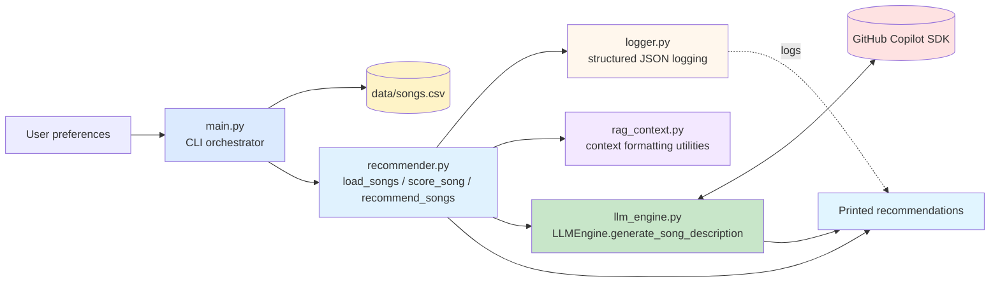

# 🎵 Music Recommender with Song Descriptions

https://github.com/user-attachments/assets/ee09d37a-f186-49fd-93a9-a77b477c22de

## Original Project Context

This project extends the **Music Recommender Simulation** (from Modules 1-3), which scored songs based on user preferences for genre, mood, energy, acousticness, and other audio features using rule-based weighted scoring. The original system ranked candidates by static point totals and returned explanations like "genre match (+2.0); mood match (+1.0)". 

**CURRENT ARCHITECTURE:** This project keeps the recommendation logic deterministic and uses the LLM only for optional song descriptions. The system now:
- Uses rule-based scoring to identify the top-N recommendations
- Generates descriptions for each selected song from its metadata and title/artist
- Falls back to rule-based descriptions if the Copilot SDK is unavailable or fails
- Logs scoring and LLM activity in structured JSON for debugging and traceability

## Project Summary

BeatBuddy is a Python music recommendation system that recommends songs from a small CSV catalog based on user preferences (genre, mood, energy, tempo, valence, danceability, acousticness) and generates AI-powered song descriptions via GitHub Copilot's managed LLM. The recommendation scores are rule-based and reproducible. If the LLM is unavailable, disabled, or fails, the system falls back to rule-based descriptions so the CLI still returns usable output.

## Architecture Overview

BeatBuddy implements a simple two-stage recommendation pipeline with supporting utilities:

1. **Scoring Engine** (`recommender.py`): Loads songs from CSV, scores each against user preferences using rule-based logic (+2 genre match, +1 mood match, +1 for optional artist match, +1 for feature closeness, +energy similarity), and returns top-k recommendations sorted by score.

2. **Description Engine** (`llm_engine.py`): Calls the GitHub Copilot Python SDK to generate a short description for each recommended song using song metadata only. It resolves to an available Copilot model automatically and falls back to rule-based descriptions when needed.

3. **Context Utilities** (`rag_context.py`): Builds formatted song, user, and match context strings for tests and future prompt experiments. The current CLI path does not route through this module.

The `main.py` orchestrator drives the flow: load songs → score → generate descriptions for the top recommendations → display results. If the LLM path fails, the code falls back to the base rule-based descriptions.

### Data Flow

```
User Preferences → Load Songs CSV → Score Each Song (rule-based)
                                           ↓
                                  Retrieve Top K
                                           ↓
                    Generate Song Description with Copilot SDK
                                           ↓
                    (Fallback to rule-based description if needed)
                                           ↓
                              Output Recommendations
```

### Mermaid Diagram



## Folder Structure

```
├── src/
│   ├── __init__.py
│   ├── main.py                 # CLI orchestrator
│   ├── recommender.py          # Core scoring + optional description enhancement
│   ├── llm_engine.py           # GitHub Copilot SDK integration with model fallback
│   ├── rag_context.py          # Context formatting utilities for tests/future prompts
│   └── logger.py               # Structured JSON logging
├── assets/                     # static assets (images, thumbnails)
├── data/
│   └── songs.csv               # 20-song catalog with audio features
├── tests/
│   ├── test_recommender.py     # Original functionality tests
│   ├── test_llm_connection.py  # LLM engine tests
│   └── test_rag_pipeline.py    # End-to-end description pipeline tests
├── requirements.txt
├── README.md
└── model_card.md
```

### Setup

#### Prerequisites

- Python 3.8 or higher
- pip
- **GitHub Copilot SDK** for LLM integration
  - Installed via `pip install -r requirements.txt`
  - Requires a valid GitHub Copilot subscription
  - Uses your GitHub authentication credentials

#### Quick Start

1. **Create and activate a virtual environment** *(first-time setup only — skip if `.venv` already exists):*
   ```bash
   python -m venv .venv
   ```
   Then activate it:
   - **Windows (PowerShell):** `.\.venv\Scripts\Activate.ps1`
   - **macOS/Linux:** `source .venv/bin/activate`

   Your prompt will show `(.venv)` when the environment is active. Re-run the activation command at the start of each new terminal session.

   > The virtual environment must be active whenever you run the app. If it isn't, `python` resolves to your global interpreter, which won't have `github-copilot-sdk` installed, and the system will fall back to rule-based descriptions.

   You can also force the fallback path for local testing with `LLM_FORCE_FALLBACK=1`.

2. **Install dependencies:**
   ```bash
   pip install -r requirements.txt
   ```

3. **Authenticate with GitHub (if not already done):**
   ```bash
   # The Copilot SDK will use your default GitHub authentication
   # If you haven't authenticated yet:
   gh auth login
   ```

4. **Run the app:**
   ```bash
   python -m src.main
   ```
   - If the Copilot SDK is unavailable, disabled, or fails, the system automatically falls back to rule-based descriptions
   - Check logs to see which mode was used (`source: "llm"` vs `source: "fallback"`)
   - Note: Use `python -m src.main` (module mode) instead of `python src/main.py` to avoid relative import errors

4. **Run tests:**
   ```bash
   pytest                                    # All tests
   pytest tests/test_rag_pipeline.py        # Description pipeline tests only
   ```

## Sample Interactions

```text
############ User Profile 1 ############
Profile:
  favorite_genre: k-pop
  favorite_mood: melancholy
  target_energy: 1.5
  likes_acoustic: True
2026-05-04 19:18:22 - music_recommender - INFO - LLM Engine initialized with Copilot SDK, model=gpt-4.1
2026-05-04 19:18:22 - music_recommender - INFO - {"timestamp": "2026-05-04T23:18:22.251175+00:00", "event_type": "llm_call_start", "prompt_tokens": 142, "model": "gpt-4.1"}
2026-05-04 19:18:34 - music_recommender - INFO - {"timestamp": "2026-05-04T23:18:34.946768+00:00", "event_type": "llm_call_end", "prompt_tokens": 142, "completion_tokens": 91, "total_tokens": 233, "success": true, "error": null}
2026-05-04 19:18:34 - music_recommender - INFO - {"timestamp": "2026-05-04T23:18:34.948787+00:00", "event_type": "song_description_generated", "song_title": "Holy Wars... The Punishment Due", "artist": "Megadeth", "source": "llm", "description_length": 484}
2026-05-04 19:18:34 - music_recommender - INFO - {"timestamp": "2026-05-04T23:18:34.951382+00:00", "event_type": "llm_call_start", "prompt_tokens": 144, "model": "gpt-4.1"}
2026-05-04 19:18:45 - music_recommender - INFO - {"timestamp": "2026-05-04T23:18:45.185619+00:00", "event_type": "llm_call_end", "prompt_tokens": 144, "completion_tokens": 94, "total_tokens": 238, "success": true, "error": null}
2026-05-04 19:18:45 - music_recommender - INFO - {"timestamp": "2026-05-04T23:18:45.188609+00:00", "event_type": "song_description_generated", "song_title": "Voodoo People (Pendulum Remix)", "artist": "The Prodigy", "source": "llm", "description_length": 459}
2026-05-04 19:18:45 - music_recommender - INFO - {"timestamp": "2026-05-04T23:18:45.191098+00:00", "event_type": "llm_call_start", "prompt_tokens": 138, "model": "gpt-4.1"}
2026-05-04 19:18:55 - music_recommender - INFO - {"timestamp": "2026-05-04T23:18:55.047497+00:00", "event_type": "llm_call_end", "prompt_tokens": 138, "completion_tokens": 90, "total_tokens": 228, "success": true, "error": null}
2026-05-04 19:18:55 - music_recommender - INFO - {"timestamp": "2026-05-04T23:18:55.050393+00:00", "event_type": "song_description_generated", "song_title": "Ace of Spades", "artist": "Mot\u00f6rhead", "source": "llm", "description_length": 406}
2026-05-04 19:18:55 - music_recommender - INFO - {"timestamp": "2026-05-04T23:18:55.052491+00:00", "event_type": "llm_call_start", "prompt_tokens": 137, "model": "gpt-4.1"}
2026-05-04 19:20:13 - music_recommender - INFO - {"timestamp": "2026-05-04T23:20:13.308017+00:00", "event_type": "llm_call_end", "prompt_tokens": 137, "completion_tokens": 80, "total_tokens": 217, "success": true, "error": null}
2026-05-04 19:20:13 - music_recommender - INFO - {"timestamp": "2026-05-04T23:20:13.313555+00:00", "event_type": "song_description_generated", "song_title": "Rainbow Road", "artist": "nanobii", "source": "llm", "description_length": 408}
2026-05-04 19:20:13 - music_recommender - INFO - {"timestamp": "2026-05-04T23:20:13.317565+00:00", "event_type": "llm_call_start", "prompt_tokens": 136, "model": "gpt-4.1"}
2026-05-04 19:20:24 - music_recommender - INFO - {"timestamp": "2026-05-04T23:20:24.598826+00:00", "event_type": "llm_call_end", "prompt_tokens": 136, "completion_tokens": 104, "total_tokens": 240, "success": true, "error": null}
2026-05-04 19:20:24 - music_recommender - INFO - {"timestamp": "2026-05-04T23:20:24.601687+00:00", "event_type": "song_description_generated", "song_title": "Bambol\u00e9o", "artist": "Gipsy Kings", "source": "llm", "description_length": 469}

Top recommendations ([LLM Enhanced]):

========================================
1. Title      : Holy Wars... The Punishment Due
   Artist     : Megadeth
   Score      : 0.48
   Description: Holy Wars... The Punishment Due – Megadeth Description: This song explores themes of conflict, religious strife, and retribution, blending social commentary with a narrative of vengeance. Megadeth delivers these intense subjects through their signature thrash metal style, characterized by fast tempos, aggressive guitar riffs, and complex arrangements. The track’s mood is forceful and urgent, reflecting the band’s reputation for technical musicianship and thought-provoking lyrics.
========================================
2. Title      : Voodoo People (Pendulum Remix)
   Artist     : The Prodigy
   Score      : 0.47
   Description: Voodoo People (Pendulum Remix) – The Prodigy Description: This high-energy drum and bass track, remixed by Pendulum, channels themes of chaos, intensity, and the mysterious allure of the unknown. The Prodigy's signature electronic sound is fused with rapid breakbeats and driving basslines, creating an electrifying and danceable atmosphere. The mood is both edgy and invigorating, reflecting the group's reputation for pushing boundaries in electronic music.
========================================
3. Title      : Ace of Spades
   Artist     : Motörhead
   Score      : 0.46
   Description: Ace of Spades – Motörhead Description: "Ace of Spades" by Motörhead is a high-energy rock song that centers on themes of risk-taking, gambling, and living life on the edge. The lyrics evoke the thrill and danger of chance, reflecting a rebellious and intense attitude. Motörhead’s signature sound combines fast-paced rhythms, gritty vocals, and powerful guitar riffs, embodying the raw spirit of hard rock.
========================================
4. Title      : Rainbow Road
   Artist     : nanobii
   Score      : 0.42
   Description: Rainbow Road – nanobii Description: "Rainbow Road" by nanobii is an energetic chiptune track characterized by its playful, uplifting mood and fast tempo. The song evokes themes of adventure and nostalgia, drawing inspiration from video game aesthetics and carefree journeys. Nanobii's signature style blends bright, melodic synths with high-energy rhythms, creating a vibrant and joyful listening experience.
========================================
5. Title      : Bamboléo
   Artist     : Gipsy Kings
   Score      : 0.41
   Description: Bamboléo – Gipsy Kings Description: "Bamboléo" by Gipsy Kings is an upbeat, festive song that celebrates the joy and passion of life, with lyrics expressing themes of movement, freedom, and emotional exuberance. The Gipsy Kings are known for their energetic blend of traditional flamenco, rumba, and pop influences, characterized by lively guitar rhythms and vibrant vocals. The song’s spirited mood and danceable rhythm make it a staple of their signature Latin style.
========================================

############ User Profile 2 ############
Profile:
  favorite_genre: jazz
  favorite_mood: relaxed
  target_energy: 0.95
  target_danceability: 0.95
  target_acousticness: 0.95
  likes_acoustic: True
2026-05-04 19:20:24 - music_recommender - INFO - LLM Engine initialized with Copilot SDK, model=gpt-4.1
2026-05-04 19:20:24 - music_recommender - INFO - {"timestamp": "2026-05-04T23:20:24.613409+00:00", "event_type": "llm_call_start", "prompt_tokens": 138, "model": "gpt-4.1"}
2026-05-04 19:20:33 - music_recommender - INFO - {"timestamp": "2026-05-04T23:20:33.985003+00:00", "event_type": "llm_call_end", "prompt_tokens": 138, "completion_tokens": 87, "total_tokens": 225, "success": true, "error": null}
2026-05-04 19:20:33 - music_recommender - INFO - {"timestamp": "2026-05-04T23:20:33.988934+00:00", "event_type": "song_description_generated", "song_title": "Blue Train", "artist": "John Coltrane", "source": "llm", "description_length": 453}
2026-05-04 19:20:33 - music_recommender - INFO - {"timestamp": "2026-05-04T23:20:33.991976+00:00", "event_type": "llm_call_start", "prompt_tokens": 144, "model": "gpt-4.1"}
2026-05-04 19:20:45 - music_recommender - INFO - {"timestamp": "2026-05-04T23:20:45.332604+00:00", "event_type": "llm_call_end", "prompt_tokens": 144, "completion_tokens": 95, "total_tokens": 239, "success": true, "error": null}
2026-05-04 19:20:45 - music_recommender - INFO - {"timestamp": "2026-05-04T23:20:45.334605+00:00", "event_type": "song_description_generated", "song_title": "Voodoo People (Pendulum Remix)", "artist": "The Prodigy", "source": "llm", "description_length": 478}
2026-05-04 19:20:45 - music_recommender - INFO - {"timestamp": "2026-05-04T23:20:45.336850+00:00", "event_type": "llm_call_start", "prompt_tokens": 137, "model": "gpt-4.1"}
2026-05-04 19:20:55 - music_recommender - INFO - {"timestamp": "2026-05-04T23:20:55.288165+00:00", "event_type": "llm_call_end", "prompt_tokens": 137, "completion_tokens": 93, "total_tokens": 230, "success": true, "error": null}
2026-05-04 19:20:55 - music_recommender - INFO - {"timestamp": "2026-05-04T23:20:55.291945+00:00", "event_type": "song_description_generated", "song_title": "Rainbow Road", "artist": "nanobii", "source": "llm", "description_length": 483}
2026-05-04 19:20:55 - music_recommender - INFO - {"timestamp": "2026-05-04T23:20:55.293018+00:00", "event_type": "llm_call_start", "prompt_tokens": 136, "model": "gpt-4.1"}
2026-05-04 19:21:08 - music_recommender - INFO - {"timestamp": "2026-05-04T23:21:08.805313+00:00", "event_type": "llm_call_end", "prompt_tokens": 136, "completion_tokens": 100, "total_tokens": 236, "success": true, "error": null}
2026-05-04 19:21:08 - music_recommender - INFO - {"timestamp": "2026-05-04T23:21:08.809071+00:00", "event_type": "song_description_generated", "song_title": "Bamboléo", "artist": "Gipsy Kings", "source": "llm", "description_length": 458}
2026-05-04 19:21:08 - music_recommender - INFO - {"timestamp": "2026-05-04T23:21:08.811149+00:00", "event_type": "llm_call_start", "prompt_tokens": 136, "model": "gpt-4.1"}
2026-05-04 19:21:19 - music_recommender - INFO - {"timestamp": "2026-05-04T23:21:19.381912+00:00", "event_type": "llm_call_end", "prompt_tokens": 136, "completion_tokens": 86, "total_tokens": 222, "success": true, "error": null}
2026-05-04 19:21:19 - music_recommender - INFO - {"timestamp": "2026-05-04T23:21:19.381912+00:00", "event_type": "song_description_generated", "song_title": "Physical", "artist": "Dua Lipa", "source": "llm", "description_length": 443}

Top recommendations ([LLM Enhanced]):

========================================
1. Title      : Blue Train
   Artist     : John Coltrane
   Score      : 4.47
   Description: Blue Train – John Coltrane Description: "Blue Train" is a jazz composition by John Coltrane that evokes themes of journey, reflection, and emotional depth, often interpreted as capturing the feeling of a train ride through blues-inspired landscapes. The piece features Coltrane's signature expressive saxophone playing, blending soulful melodies with intricate improvisation, and is celebrated for its relaxed yet dynamic mood within the hard bop style.
========================================
2. Title      : Voodoo People (Pendulum Remix)
   Artist     : The Prodigy
   Score      : 1.98
   Description: Voodoo People (Pendulum Remix) – The Prodigy Description: This remix infuses The Prodigy's original track with Pendulum's signature high-energy drum and bass style, creating an intense and driving atmosphere. The lyrics evoke themes of mystique and rebelliousness, matching the song's pulsating rhythms and electrifying mood. The result is a dynamic blend of electronic aggression and dancefloor appeal, characteristic of both artists' innovative approaches to electronic music.
========================================
3. Title      : Rainbow Road
   Artist     : nanobii
   Score      : 1.97
   Description: Rainbow Road – nanobii Description: "Rainbow Road" by nanobii is an upbeat chiptune track that evokes a sense of playful adventure and nostalgia, drawing inspiration from video game aesthetics. The song's energetic tempo and bright melodies create a joyful, carefree atmosphere, celebrating themes of fun and imagination. Nanobii is known for blending high-energy electronic sounds with whimsical, game-inspired elements, making this track a vibrant example of their signature style.
========================================
4. Title      : Bamboléo
   Artist     : Gipsy Kings
   Score      : 1.96
   Description: Bamboléo – Gipsy Kings Description: "Bamboléo" by Gipsy Kings is an upbeat, festive song that celebrates the joy and freedom of dancing and living in the moment. The lyrics evoke themes of movement, passion, and letting go, set against a lively backdrop of flamenco-inspired rhythms and vibrant guitar work. The Gipsy Kings are known for blending traditional Spanish and Romani musical elements with pop influences, creating an energetic and danceable sound.
========================================
5. Title      : Physical
   Artist     : Dua Lipa
   Score      : 1.94
   Description: Physical – Dua Lipa Description: "Physical" by Dua Lipa is an energetic pop track that channels themes of passion, intensity, and the exhilaration of being fully present in the moment with someone. The song features a driving beat and bold production, reflecting Dua Lipa's signature blend of modern pop with retro influences. Its mood is vibrant and urgent, encouraging listeners to embrace the excitement of physical connection and movement.
========================================

############ User Profile 3 ############
Profile:
  favorite_genre: jazz
  favorite_mood: relaxed
  target_valence: 0.7
  target_tempo: 90
  likes_acoustic: True
2026-05-04 19:21:19 - music_recommender - INFO - LLM Engine initialized with Copilot SDK, model=gpt-4.1
2026-05-04 19:21:19 - music_recommender - INFO - {"timestamp": "2026-05-04T23:21:19.392045+00:00", "event_type": "llm_call_start", "prompt_tokens": 138, "model": "gpt-4.1"}
2026-05-04 19:21:29 - music_recommender - INFO - {"timestamp": "2026-05-04T23:21:29.456133+00:00", "event_type": "llm_call_end", "prompt_tokens": 138, "completion_tokens": 94, "total_tokens": 232, "success": true, "error": null}
2026-05-04 19:21:29 - music_recommender - INFO - {"timestamp": "2026-05-04T23:21:29.458701+00:00", "event_type": "song_description_generated", "song_title": "Blue Train", "artist": "John Coltrane", "source": "llm", "description_length": 491}
2026-05-04 19:21:29 - music_recommender - INFO - {"timestamp": "2026-05-04T23:21:29.460681+00:00", "event_type": "llm_call_start", "prompt_tokens": 134, "model": "gpt-4.1"}
2026-05-04 19:21:40 - music_recommender - INFO - {"timestamp": "2026-05-04T23:21:40.749517+00:00", "event_type": "llm_call_end", "prompt_tokens": 134, "completion_tokens": 85, "total_tokens": 219, "success": true, "error": null}
2026-05-04 19:21:40 - music_recommender - INFO - {"timestamp": "2026-05-04T23:21:40.766086+00:00", "event_type": "song_description_generated", "song_title": "Focus", "artist": "H.E.R.", "source": "llm", "description_length": 422}
2026-05-04 19:21:40 - music_recommender - INFO - {"timestamp": "2026-05-04T23:21:40.774486+00:00", "event_type": "llm_call_start", "prompt_tokens": 144, "model": "gpt-4.1"}
2026-05-04 19:21:50 - music_recommender - INFO - {"timestamp": "2026-05-04T23:21:50.779274+00:00", "event_type": "llm_call_end", "prompt_tokens": 144, "completion_tokens": 80, "total_tokens": 224, "success": true, "error": null}
2026-05-04 19:21:50 - music_recommender - INFO - {"timestamp": "2026-05-04T23:21:50.781993+00:00", "event_type": "song_description_generated", "song_title": "Take Me Home, Country Roads", "artist": "John Denver", "source": "llm", "description_length": 427}
2026-05-04 19:21:50 - music_recommender - INFO - {"timestamp": "2026-05-04T23:21:50.784662+00:00", "event_type": "llm_call_start", "prompt_tokens": 144, "model": "gpt-4.1"}
2026-05-04 19:22:00 - music_recommender - INFO - {"timestamp": "2026-05-04T23:22:00.283507+00:00", "event_type": "llm_call_end", "prompt_tokens": 144, "completion_tokens": 96, "total_tokens": 240, "success": true, "error": null}
2026-05-04 19:22:00 - music_recommender - INFO - {"timestamp": "2026-05-04T23:22:00.285656+00:00", "event_type": "song_description_generated", "song_title": "Shut Up and Dance", "artist": "Walk The Moon", "source": "llm", "description_length": 458}
2026-05-04 19:22:00 - music_recommender - INFO - {"timestamp": "2026-05-04T23:22:00.288918+00:00", "event_type": "llm_call_start", "prompt_tokens": 136, "model": "gpt-4.1"}
2026-05-04 19:22:11 - music_recommender - INFO - {"timestamp": "2026-05-04T23:22:11.333535+00:00", "event_type": "llm_call_end", "prompt_tokens": 136, "completion_tokens": 97, "total_tokens": 233, "success": true, "error": null}
2026-05-04 19:22:11 - music_recommender - INFO - {"timestamp": "2026-05-04T23:22:11.337293+00:00", "event_type": "song_description_generated", "song_title": "Weightless", "artist": "Marconi Union", "source": "llm", "description_length": 530}

Top recommendations ([LLM Enhanced]):

========================================
1. Title      : Blue Train
   Artist     : John Coltrane
   Score      : 5.00
   Description: Blue Train – John Coltrane Description: "Blue Train" is a jazz composition by John Coltrane that evokes a contemplative and soulful mood, often interpreted as a musical journey or reflection on life's transitions. The piece is characterized by Coltrane's expressive saxophone playing and intricate improvisation, blending blues influences with sophisticated harmonies. Coltrane's style on this track showcases his innovative approach to jazz, marked by emotional depth and technical mastery.
========================================
2. Title      : Focus
   Artist     : H.E.R.
   Score      : 2.00
   Description: Focus – H.E.R. Description: "Focus" by H.E.R. is a smooth, introspective track that explores themes of longing for attention and emotional connection in a relationship. The song features H.E.R.'s signature soulful vocals layered over mellow, lofi-inspired production, creating a contemplative and intimate mood. Her musical style blends elements of R&B and contemporary soul, emphasizing vulnerability and nuanced emotion.
========================================
3. Title      : Take Me Home, Country Roads
   Artist     : John Denver
   Score      : 2.00
   Description: Take Me Home, Country Roads – John Denver Description: This song evokes a sense of longing and nostalgia, painting a vivid picture of rural landscapes and the comfort of returning home. John Denver’s warm vocals and signature country style create a heartfelt tribute to the beauty and simplicity of country life. The track’s gentle melody and reflective mood have made it an enduring classic in American folk and country music.
========================================
4. Title      : Shut Up and Dance
   Artist     : Walk The Moon
   Score      : 1.00
   Description: Shut Up and Dance – Walk The Moon Description: "Shut Up and Dance" by Walk The Moon is an upbeat pop song that captures the excitement and spontaneity of meeting someone on the dance floor and letting go of inhibitions. The lyrics center around themes of youthful freedom, joy, and living in the moment. Walk The Moon is known for their energetic, dance-friendly sound and catchy melodies, which are reflected in this track's lively tempo and uplifting mood.
========================================
5. Title      : Weightless
   Artist     : Marconi Union
   Score      : 1.00
   Description: Weightless – Marconi Union Description: "Weightless" by Marconi Union is an ambient track designed to evoke a sense of calm and relaxation, with a focus on soothing soundscapes and gentle rhythms. The song does not feature traditional lyrics, instead using atmospheric textures and minimalist melodies to create a tranquil, meditative mood. Marconi Union is known for their innovative approach to ambient and electronic music, often blending subtle electronic elements with organic sounds to craft immersive listening experiences.
========================================
```

## Design Decisions

### 1. **LLM for Song Descriptions**
**Decision:** Use the LLM only after ranking to generate a short description for each recommended song.  
**Trade-off:** Requires external API access and adds latency, but keeps the recommendation scores deterministic and the descriptions optional.

### 2. **Rule-Based Scoring (No ML Model)**
**Decision:** Keep the scoring logic simple and interpretable (weighted points) rather than training a ML model.  
**Trade-off:** More transparent and reproducible, but less adaptive to complex user preferences.

### 3. **Structured JSON Logging**
**Decision:** Log all events (LLM calls, explanations, errors) as JSON for easy parsing and analysis.  
**Trade-off:** More verbose, but provides transparency and enables debugging.

### 4. **Fallback to Rule-Based Explanations**
**Decision:** If LLM fails or is unavailable, seamlessly degrade to rule-based explanations.  
**Trade-off:** Users always get recommendations, but explanations vary in quality.

## Testing Summary

**Test Coverage:** 15 unit and integration tests across 3 test modules.

### What Worked

- ✅ Song loading and CSV parsing correctly validated metadata
- ✅ Rule-based scoring is consistent and reproducible
- ✅ LLM prompt building and fallback description generation work as expected
- ✅ Fallback mechanism works reliably when LLM unavailable
- ✅ Recommendation scores remain identical with/without LLM (only explanations change)
- ✅ All 15 tests pass (0 failures)

### What Didn't Work (and Fixes Applied)

- The LLM was not being given retrieved song context, so the Copilot SDK did not provide novel explanations. I fixed this by using the SDK to include more information about recommended songs.

- I realized the songs in the CSV were not real; I replaced them with real songs so the LLM can provide accurate backstories.

### What I Learned

- **Graceful degradation is critical** in production AI systems. The system must provide value even when external services fail.
- **Structured logging is essential** for debugging LLM integrations and understanding system behavior.
- **Prompt engineering matters** — small changes to the LLM prompt significantly affect output quality.
- **Fallback mechanisms are not optional** — they're a core requirement for reliability.

## Reflection

**What This Project Taught About AI and Problem-Solving:**

1. AI is great to provide more explanatory context. Rather than just providing a list of recommended songs, it can talk about what are they about.

2. Keeping rule-based scoring simple sacrifices adaptive personalization. Using the GitHub Copilot SDK requires managing token usage, model availability, and fallback behavior.

**Next Steps (If Extending):**
- Integrate multiple LLM providers (Azure OpenAI, Anthropic Claude, local models) with a provider abstraction
- Implement caching for frequently recommended songs to reduce LLM API costs
- Add user feedback loops to measure explanation quality and improve prompts
- Expand the song catalog and add more sophisticated features (lyrics, popularity, trends)
- Build a web interface (FastAPI + React) for broader usability

---

**Technical Stack:**
- Python 3.8+
- GitHub Copilot SDK
- pandas, pytest, tenacity, pydantic, python-dotenv
- Structured logging, retry patterns, graceful degradation

**Lessons Applied:**
- Always build with fallback mechanisms
- Log comprehensively for observability
- Keep systems simple and understandable
- Test edge cases (missing API keys, API failures, extreme preferences)
- Document design decisions, not just code
