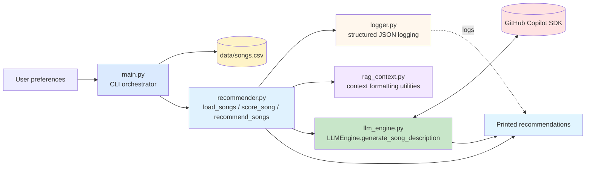

# 🎵 Music Recommender with Song Descriptions

## Original Project Context

This project extends the **Music Recommender Simulation** (from Modules 1-3), which scored songs based on user preferences for genre, mood, energy, acousticness, and other audio features using rule-based weighted scoring. The original system ranked candidates by static point totals and returned explanations like "genre match (+2.0); mood match (+1.0)". 

**CURRENT ARCHITECTURE:** This project keeps the recommendation logic deterministic and uses the LLM only for optional song descriptions. The system now:
- Uses rule-based scoring to identify the top-N recommendations
- Generates descriptions for each selected song from its metadata and title/artist
- Falls back to rule-based descriptions if the Copilot SDK is unavailable or fails
- Logs scoring and LLM activity in structured JSON for debugging and traceability

## Project Summary

BeatBuddy is a Python music recommendation system that recommends songs from a small CSV catalog based on user preferences (genre, mood, energy, tempo, valence, danceability, acousticness) and generates AI-powered song descriptions via GitHub Copilot's managed LLM. The recommendation scores are rule-based and reproducible. If the LLM is unavailable, disabled, or fails, the system falls back to rule-based descriptions so the CLI still returns usable output.

## Architecture Overview

BeatBuddy implements a simple two-stage recommendation pipeline with supporting utilities:

1. **Scoring Engine** (`recommender.py`): Loads songs from CSV, scores each against user preferences using rule-based logic (+2 genre match, +1 mood match, +1 for optional artist match, +1 for feature closeness, +energy similarity), and returns top-k recommendations sorted by score.

2. **Description Engine** (`llm_engine.py`): Calls the GitHub Copilot Python SDK to generate a short description for each recommended song using song metadata only. It resolves to an available Copilot model automatically and falls back to rule-based descriptions when needed.

3. **Context Utilities** (`rag_context.py`): Builds formatted song, user, and match context strings for tests and future prompt experiments. The current CLI path does not route through this module.

The `main.py` orchestrator drives the flow: load songs → score → generate descriptions for the top recommendations → display results. If the LLM path fails, the code falls back to the base rule-based descriptions.

### Data Flow

```
User Preferences → Load Songs CSV → Score Each Song (rule-based)
                                           ↓
                                  Retrieve Top K
                                           ↓
                    Generate Song Description with Copilot SDK
                                           ↓
                    (Fallback to rule-based description if needed)
                                           ↓
                              Output Recommendations
```

### Mermaid Diagram



## Folder Structure

```
├── src/
│   ├── __init__.py
│   ├── main.py                 # CLI orchestrator
│   ├── recommender.py          # Core scoring + optional description enhancement
│   ├── llm_engine.py           # GitHub Copilot SDK integration with model fallback
│   ├── rag_context.py          # Context formatting utilities for tests/future prompts
│   └── logger.py               # Structured JSON logging
├── assets/                     # static assets (images, thumbnails)
├── data/
│   └── songs.csv               # 20-song catalog with audio features
├── tests/
│   ├── test_recommender.py     # Original functionality tests
│   ├── test_llm_connection.py  # LLM engine tests
│   └── test_rag_pipeline.py    # End-to-end description pipeline tests
├── requirements.txt
├── README.md
└── model_card.md
```

### Setup

#### Prerequisites

- Python 3.8 or higher
- pip
- **GitHub Copilot SDK** for LLM integration
  - Installed via `pip install -r requirements.txt`
  - Requires a valid GitHub Copilot subscription
  - Uses your GitHub authentication credentials

#### Quick Start

1. **Create and activate a virtual environment** *(first-time setup only — skip if `.venv` already exists):*
   ```bash
   python -m venv .venv
   ```
   Then activate it:
   - **Windows (PowerShell):** `.\.venv\Scripts\Activate.ps1`
   - **macOS/Linux:** `source .venv/bin/activate`

   Your prompt will show `(.venv)` when the environment is active. Re-run the activation command at the start of each new terminal session.

   > The virtual environment must be active whenever you run the app. If it isn't, `python` resolves to your global interpreter, which won't have `github-copilot-sdk` installed, and the system will fall back to rule-based descriptions.

   You can also force the fallback path for local testing with `LLM_FORCE_FALLBACK=1`.

2. **Install dependencies:**
   ```bash
   pip install -r requirements.txt
   ```

3. **Authenticate with GitHub (if not already done):**
   ```bash
   # The Copilot SDK will use your default GitHub authentication
   # If you haven't authenticated yet:
   gh auth login
   ```

4. **Run the app:**
   ```bash
   python -m src.main
   ```
   - If the Copilot SDK is unavailable, disabled, or fails, the system automatically falls back to rule-based descriptions
   - Check logs to see which mode was used (`source: "llm"` vs `source: "fallback"`)
   - Note: Use `python -m src.main` (module mode) instead of `python src/main.py` to avoid relative import errors

4. **Run tests:**
   ```bash
   pytest                                    # All tests
   pytest tests/test_rag_pipeline.py        # Description pipeline tests only
   ```

## Sample Interactions

```text
############ User Profile 1 ############
Profile:
  favorite_genre: k-pop
  favorite_mood: melancholy
  target_energy: 1.5
  likes_acoustic: True
2026-05-04 17:54:28 - music_recommender - INFO - LLM Engine initialized with Copilot SDK, model=gpt-4.1
2026-05-04 17:54:28 - music_recommender - INFO - {"timestamp": "2026-05-04T21:54:28.788896+00:00", "event_type": "llm_call_start", "prompt_tokens": 142, "model": "gpt-4.1"}
2026-05-04 17:54:31 - music_recommender - WARNING - Copilot model "gpt-4.1" is unavailable; using "gpt-5.4-mini" instead.
2026-05-04 17:54:40 - music_recommender - INFO - {"timestamp": "2026-05-04T21:54:40.778095+00:00", "event_type": "llm_call_end", "prompt_tokens": 142, "completion_tokens": 160, "total_tokens": 302, "success": true, "error": null}
2026-05-04 17:54:40 - music_recommender - INFO - {"timestamp": "2026-05-04T21:54:40.780106+00:00", "event_type": "song_description_generated", "song_title": "Holy Wars... The Punishment Due", "artist": "Megadeth", "source": "llm", "description_length": 364}
2026-05-04 17:54:40 - music_recommender - INFO - {"timestamp": "2026-05-04T21:54:40.782769+00:00", "event_type": "llm_call_start", "prompt_tokens": 144, "model": "gpt-4"}
2026-05-04 17:54:50 - music_recommender - INFO - {"timestamp": "2026-05-04T21:54:50.132323+00:00", "event_type": "llm_call_end", "prompt_tokens": 144, "completion_tokens": 243, "total_tokens": 387, "success": true, "error": null}
2026-05-04 17:54:50 - music_recommender - INFO - {"timestamp": "2026-05-04T21:54:50.132942+00:00", "event_type": "song_description_generated", "song_title": "Voodoo People (Pendulum Remix)", "artist": "The Prodigy", "source": "llm", "description_length": 384}
2026-05-04 17:54:50 - music_recommender - INFO - {"timestamp": "2026-05-04T21:54:50.138216+00:00", "event_type": "llm_call_start", "prompt_tokens": 138, "model": "gpt-4"}
2026-05-04 17:54:59 - music_recommender - INFO - {"timestamp": "2026-05-04T21:54:59.762345+00:00", "event_type": "llm_call_end", "prompt_tokens": 138, "completion_tokens": 130, "total_tokens": 268, "success": true, "error": null}
2026-05-04 17:54:59 - music_recommender - INFO - {"timestamp": "2026-05-04T21:54:59.762345+00:00", "event_type": "song_description_generated", "song_title": "Ace of Spades", "artist": "Mot\u00f6rhead", "source": "llm", "description_length": 338}
2026-05-04 17:54:59 - music_recommender - INFO - {"timestamp": "2026-05-04T21:54:59.762345+00:00", "event_type": "llm_call_start", "prompt_tokens": 137, "model": "gpt-4"}
2026-05-04 17:55:10 - music_recommender - INFO - {"timestamp": "2026-05-04T21:55:10.734920+00:00", "event_type": "llm_call_end", "prompt_tokens": 137, "completion_tokens": 181, "total_tokens": 318, "success": true, "error": null}
2026-05-04 17:55:10 - music_recommender - INFO - {"timestamp": "2026-05-04T21:55:10.737272+00:00", "event_type": "song_description_generated", "song_title": "Rainbow Road", "artist": "nanobii", "source": "llm", "description_length": 324}
2026-05-04 17:55:10 - music_recommender - INFO - {"timestamp": "2026-05-04T21:55:10.738527+00:00", "event_type": "llm_call_start", "prompt_tokens": 136, "model": "gpt-4"}
2026-05-04 17:55:23 - music_recommender - INFO - {"timestamp": "2026-05-04T21:55:23.221563+00:00", "event_type": "llm_call_end", "prompt_tokens": 136, "completion_tokens": 196, "total_tokens": 332, "success": true, "error": null}
2026-05-04 17:55:23 - music_recommender - INFO - {"timestamp": "2026-05-04T21:55:23.221563+00:00", "event_type": "song_description_generated", "song_title": "Bambol\u00e9o", "artist": "Gipsy Kings", "source": "llm", "description_length": 376}

Top recommendations ([LLM Enhanced]):

========================================
1. Title      : Holy Wars... The Punishment Due
   Artist     : Megadeth
   Score      : 0.48
   Description: Holy Wars... The Punishment Due – Megadeth Description: A politically charged thrash metal song that tackles war, religion, and conflict, moving through a tense, aggressive narrative about violence and its consequences. Megadeth’s style is fast, technical, and sharp-edged, with complex guitar work and a confrontational heaviness that defines the band’s identity.
========================================
2. Title      : Voodoo People (Pendulum Remix)
   Artist     : The Prodigy
   Score      : 0.47
   Description: Voodoo People (Pendulum Remix) – The Prodigy Description: The song centers on a dark, trance-like atmosphere with themes of ritual, tension, and being pulled into an intense, almost hypnotic force. The Prodigy are known for a fierce, rave-driven electronic sound that mixes breakbeat, big beat, and punk energy, and this remix pushes that identity into fast, aggressive drum and bass.
========================================
3. Title      : Ace of Spades
   Artist     : Motörhead
   Score      : 0.46
   Description: Ace of Spades – Motörhead Description: A hard-driving rock song about gambling, risk, and living on the edge, with a reckless, defiant mood and a fast, intense momentum. Motörhead are known for their loud, aggressive blend of heavy rock and punk energy, built around Lemmy Kilmister’s gritty vocals, distorted bass, and relentless rhythm.
========================================
4. Title      : Rainbow Road
   Artist     : nanobii
   Score      : 0.42
   Description: Rainbow Road – nanobii Description: “Rainbow Road” is a bright, fast-paced chiptune track that evokes a sense of playful movement, speed, and colorful arcade-like energy. nanobii is known for upbeat, melodic electronic music with a retro game-inspired sound, and this song fits that style with its sparkling, danceable feel.
========================================
5. Title      : Bamboléo
   Artist     : Gipsy Kings
   Score      : 0.41
   Description: Bamboléo – Gipsy Kings Description: "Bamboléo" is an upbeat, dance-driven song centered on themes of love, longing, and celebration, with a lively, communal feel that makes it a favorite for festive settings. Gipsy Kings are known for their energetic blend of flamenco, rumba, Latin pop, and Spanish guitar, with strong rhythmic acoustic instrumentation and passionate vocals.
========================================

############ User Profile 2 ############
Profile:
  favorite_genre: jazz
  favorite_mood: relaxed
  target_energy: 0.95
  target_danceability: 0.95
  target_acousticness: 0.95
  likes_acoustic: True
2026-05-04 17:55:23 - music_recommender - INFO - LLM Engine initialized with Copilot SDK, model=gpt-4.1
2026-05-04 17:55:23 - music_recommender - INFO - {"timestamp": "2026-05-04T21:55:23.232596+00:00", "event_type": "llm_call_start", "prompt_tokens": 138, "model": "gpt-4.1"}
2026-05-04 17:55:25 - music_recommender - WARNING - Copilot model "gpt-4.1" is unavailable; using "gpt-5.4-mini" instead.
2026-05-04 17:55:33 - music_recommender - INFO - {"timestamp": "2026-05-04T21:55:33.122590+00:00", "event_type": "llm_call_end", "prompt_tokens": 138, "completion_tokens": 263, "total_tokens": 401, "success": true, "error": null}
2026-05-04 17:55:33 - music_recommender - INFO - {"timestamp": "2026-05-04T21:55:33.122590+00:00", "event_type": "song_description_generated", "song_title": "Blue Train", "artist": "John Coltrane", "source": "llm", "description_length": 354}
2026-05-04 17:55:33 - music_recommender - INFO - {"timestamp": "2026-05-04T21:55:33.122590+00:00", "event_type": "llm_call_start", "prompt_tokens": 144, "model": "gpt-4.1"}
2026-05-04 17:55:46 - music_recommender - INFO - {"timestamp": "2026-05-04T21:55:46.074719+00:00", "event_type": "llm_call_end", "prompt_tokens": 144, "completion_tokens": 208, "total_tokens": 352, "success": true, "error": null}
2026-05-04 17:55:46 - music_recommender - INFO - {"timestamp": "2026-05-04T21:55:46.079289+00:00", "event_type": "song_description_generated", "song_title": "Voodoo People (Pendulum Remix)", "artist": "The Prodigy", "source": "llm", "description_length": 426}
2026-05-04 17:55:46 - music_recommender - INFO - {"timestamp": "2026-05-04T21:55:46.080670+00:00", "event_type": "llm_call_start", "prompt_tokens": 137, "model": "gpt-4.1"}
2026-05-04 17:55:59 - music_recommender - INFO - {"timestamp": "2026-05-04T21:55:59.223831+00:00", "event_type": "llm_call_end", "prompt_tokens": 137, "completion_tokens": 332, "total_tokens": 469, "success": true, "error": null}
2026-05-04 17:55:59 - music_recommender - INFO - {"timestamp": "2026-05-04T21:55:59.250235+00:00", "event_type": "song_description_generated", "song_title": "Rainbow Road", "artist": "nanobii", "source": "llm", "description_length": 314}
2026-05-04 17:55:59 - music_recommender - INFO - {"timestamp": "2026-05-04T21:55:59.273058+00:00", "event_type": "llm_call_start", "prompt_tokens": 136, "model": "gpt-4.1"}
2026-05-04 17:56:10 - music_recommender - INFO - {"timestamp": "2026-05-04T21:56:10.292726+00:00", "event_type": "llm_call_end", "prompt_tokens": 136, "completion_tokens": 156, "total_tokens": 292, "success": true, "error": null}
2026-05-04 17:56:10 - music_recommender - INFO - {"timestamp": "2026-05-04T21:56:10.292726+00:00", "event_type": "song_description_generated", "song_title": "Bambol\u00e9o", "artist": "Gipsy Kings", "source": "llm", "description_length": 329}
2026-05-04 17:56:10 - music_recommender - INFO - {"timestamp": "2026-05-04T21:56:10.292726+00:00", "event_type": "llm_call_start", "prompt_tokens": 136, "model": "gpt-4.1"}
2026-05-04 17:56:20 - music_recommender - INFO - {"timestamp": "2026-05-04T21:56:20.861520+00:00", "event_type": "llm_call_end", "prompt_tokens": 136, "completion_tokens": 131, "total_tokens": 267, "success": true, "error": null}
2026-05-04 17:56:20 - music_recommender - INFO - {"timestamp": "2026-05-04T21:56:20.864720+00:00", "event_type": "song_description_generated", "song_title": "Physical", "artist": "Dua Lipa", "source": "llm", "description_length": 260}

Top recommendations ([LLM Enhanced]):

========================================
1. Title      : Blue Train
   Artist     : John Coltrane
   Score      : 4.47
   Description: Blue Train – John Coltrane Description: As an instrumental jazz piece, it does not tell a lyrical story, but it conveys a cool, blues-inflected mood centered on improvisation and ensemble interplay. John Coltrane was an influential jazz saxophonist and composer known for his distinctive tone, advanced improvisation, and exploratory approach to harmony.
========================================
2. Title      : Voodoo People (Pendulum Remix)
   Artist     : The Prodigy
   Score      : 1.98
   Description: Voodoo People (Pendulum Remix) – The Prodigy Description: The song centers on a dark, hypnotic atmosphere built around mystical and confrontational imagery, with a tense, high-energy mood rather than a detailed story. The Prodigy are known for their aggressive, rave-rooted electronic sound that blends breakbeat, punk attitude, and hard-edged dance music, and this remix pushes that intensity into a fast drum and bass style.
========================================
3. Title      : Rainbow Road
   Artist     : nanobii
   Score      : 1.97
   Description: Rainbow Road – nanobii Description: A bright, fast-moving chiptune-style track that leans into a playful, game-like mood and a sense of colorful momentum rather than a detailed story. nanobii is known for upbeat, melodic electronic music that blends chiptune and dance influences with a polished, high-energy feel.
========================================
4. Title      : Bamboléo
   Artist     : Gipsy Kings
   Score      : 1.96
   Description: Bamboléo – Gipsy Kings Description: “Bamboléo” is a lively, celebratory song centered on love, longing, and the pull of danceable rhythm, with a bright, festive mood. Gipsy Kings are known for their flamenco-influenced rumba style, blending Spanish and Latin rhythms with acoustic guitars, hand percussion, and passionate vocals.
========================================
5. Title      : Physical
   Artist     : Dua Lipa
   Score      : 1.94
   Description: Physical – Dua Lipa Description: A high-energy pop song about intense attraction, desire, and the rush of a relationship that feels all-consuming. It reflects Dua Lipa’s sleek, modern dance-pop style, with a bold, upbeat sound and a confident, club-ready mood.
========================================

############ User Profile 3 ############
Profile:
  favorite_genre: jazz
  favorite_mood: relaxed
  target_valence: 0.7
  target_tempo: 90
  likes_acoustic: True
2026-05-04 17:56:20 - music_recommender - INFO - LLM Engine initialized with Copilot SDK, model=gpt-4.1
2026-05-04 17:56:20 - music_recommender - INFO - {"timestamp": "2026-05-04T21:56:20.878647+00:00", "event_type": "llm_call_start", "prompt_tokens": 138, "model": "gpt-4.1"}
2026-05-04 17:56:23 - music_recommender - WARNING - Copilot model "gpt-4.1" is unavailable; using "gpt-5.4-mini" instead.
2026-05-04 17:56:32 - music_recommender - INFO - {"timestamp": "2026-05-04T21:56:32.438637+00:00", "event_type": "llm_call_end", "prompt_tokens": 138, "completion_tokens": 178, "total_tokens": 316, "success": true, "error": null}
2026-05-04 17:56:32 - music_recommender - INFO - {"timestamp": "2026-05-04T21:56:32.440987+00:00", "event_type": "song_description_generated", "song_title": "Blue Train", "artist": "John Coltrane", "source": "llm", "description_length": 361}
2026-05-04 17:56:32 - music_recommender - INFO - {"timestamp": "2026-05-04T21:56:32.440987+00:00", "event_type": "llm_call_start", "prompt_tokens": 134, "model": "gpt-4.1"}
2026-05-04 17:56:43 - music_recommender - INFO - {"timestamp": "2026-05-04T21:56:43.107890+00:00", "event_type": "llm_call_end", "prompt_tokens": 134, "completion_tokens": 153, "total_tokens": 287, "success": true, "error": null}
2026-05-04 17:56:43 - music_recommender - INFO - {"timestamp": "2026-05-04T21:56:43.111663+00:00", "event_type": "song_description_generated", "song_title": "Focus", "artist": "H.E.R.", "source": "llm", "description_length": 361}
2026-05-04 17:56:43 - music_recommender - INFO - {"timestamp": "2026-05-04T21:56:43.113549+00:00", "event_type": "llm_call_start", "prompt_tokens": 144, "model": "gpt-4.1"}
2026-05-04 17:56:55 - music_recommender - INFO - {"timestamp": "2026-05-04T21:56:55.020369+00:00", "event_type": "llm_call_end", "prompt_tokens": 144, "completion_tokens": 164, "total_tokens": 308, "success": true, "error": null}
2026-05-04 17:56:55 - music_recommender - INFO - {"timestamp": "2026-05-04T21:56:55.020369+00:00", "event_type": "song_description_generated", "song_title": "Take Me Home, Country Roads", "artist": "John Denver", "source": "llm", "description_length": 361}
2026-05-04 17:56:55 - music_recommender - INFO - {"timestamp": "2026-05-04T21:56:55.020369+00:00", "event_type": "llm_call_start", "prompt_tokens": 144, "model": "gpt-4.1"}
2026-05-04 17:57:05 - music_recommender - INFO - {"timestamp": "2026-05-04T21:57:05.933345+00:00", "event_type": "llm_call_end", "prompt_tokens": 144, "completion_tokens": 169, "total_tokens": 313, "success": true, "error": null}
2026-05-04 17:57:05 - music_recommender - INFO - {"timestamp": "2026-05-04T21:57:05.933345+00:00", "event_type": "song_description_generated", "song_title": "Shut Up and Dance", "artist": "Walk The Moon", "source": "llm", "description_length": 324}
2026-05-04 17:57:05 - music_recommender - INFO - {"timestamp": "2026-05-04T21:57:05.933345+00:00", "event_type": "llm_call_start", "prompt_tokens": 136, "model": "gpt-4.1"}
2026-05-04 17:57:15 - music_recommender - INFO - {"timestamp": "2026-05-04T21:57:15.673753+00:00", "event_type": "llm_call_end", "prompt_tokens": 136, "completion_tokens": 162, "total_tokens": 298, "success": true, "error": null}
2026-05-04 17:57:15 - music_recommender - INFO - {"timestamp": "2026-05-04T21:57:15.673753+00:00", "event_type": "song_description_generated", "song_title": "Weightless", "artist": "Marconi Union", "source": "llm", "description_length": 338}

Top recommendations ([LLM Enhanced]):

========================================
1. Title      : Blue Train
   Artist     : John Coltrane
   Score      : 5.00
   Description: Blue Train – John Coltrane Description: An instrumental jazz piece with a cool, blues-inflected feel, "Blue Train" is known for its steady groove, lyrical horn lines, and relaxed but focused mood. John Coltrane’s style combines expressive improvisation, strong harmonic drive, and a clear identity as one of jazz’s most influential saxophonists and bandleaders.
========================================
2. Title      : Focus
   Artist     : H.E.R.
   Score      : 2.00
   Description: Focus – H.E.R. Description: “Focus” is a restrained R&B ballad about wanting a partner’s full attention and emotional presence, with lyrics centered on longing, vulnerability, and the tension of feeling overlooked. H.E.R. is known for a smooth, soulful sound that blends contemporary R&B with intimate, understated production and emotionally direct songwriting.
========================================
3. Title      : Take Me Home, Country Roads
   Artist     : John Denver
   Score      : 2.00
   Description: Take Me Home, Country Roads – John Denver Description: A nostalgic country-folk song about longing for home and the comfort of familiar landscapes, with imagery centered on rural roads, mountains, and a deep sense of place. John Denver is known for his warm, acoustic style and gentle vocal delivery, blending country and folk into an inviting, heartfelt sound.
========================================
4. Title      : Shut Up and Dance
   Artist     : Walk The Moon
   Score      : 1.00
   Description: Shut Up and Dance – Walk The Moon Description: "Shut Up and Dance" is an upbeat pop song about being swept up in a spontaneous night of dancing and attraction, with a carefree, celebratory mood. Walk The Moon are known for bright, anthemic pop-rock with catchy hooks, energetic rhythms, and a polished indie-pop sensibility.
========================================
5. Title      : Weightless
   Artist     : Marconi Union
   Score      : 1.00
   Description: Weightless – Marconi Union Description: An instrumental piece, “Weightless” doesn’t tell a lyrical story; instead, it creates a slow, drifting atmosphere that feels calm, spacious, and reflective. Marconi Union are known for understated electronic ambient music that blends soft textures, gentle rhythms, and a restrained, immersive mood.
========================================
```

## Design Decisions

### 1. **LLM for Song Descriptions**
**Decision:** Use the LLM only after ranking to generate a short description for each recommended song.  
**Trade-off:** Requires external API access and adds latency, but keeps the recommendation scores deterministic and the descriptions optional.

### 2. **Rule-Based Scoring (No ML Model)**
**Decision:** Keep the scoring logic simple and interpretable (weighted points) rather than training a ML model.  
**Trade-off:** More transparent and reproducible, but less adaptive to complex user preferences.

### 3. **Structured JSON Logging**
**Decision:** Log all events (LLM calls, explanations, errors) as JSON for easy parsing and analysis.  
**Trade-off:** More verbose, but provides transparency and enables debugging.

### 4. **Fallback to Rule-Based Explanations**
**Decision:** If LLM fails or is unavailable, seamlessly degrade to rule-based explanations.  
**Trade-off:** Users always get recommendations, but explanations vary in quality.

## Testing Summary

**Test Coverage:** 15 unit and integration tests across 3 test modules.

### What Worked

- ✅ Song loading and CSV parsing correctly validated metadata
- ✅ Rule-based scoring is consistent and reproducible
- ✅ LLM prompt building and fallback description generation work as expected
- ✅ Fallback mechanism works reliably when LLM unavailable
- ✅ Recommendation scores remain identical with/without LLM (only explanations change)
- ✅ All 15 tests pass (0 failures)

### What Didn't Work (and Fixes Applied)

- The LLM was not being given retrieved song context, so the Copilot SDK did not provide novel explanations. I fixed this by using the SDK to include more information about recommended songs.

- I realized the songs in the CSV were not real; I replaced them with real songs so the LLM can provide accurate backstories.

### What I Learned

- **Graceful degradation is critical** in production AI systems. The system must provide value even when external services fail.
- **Structured logging is essential** for debugging LLM integrations and understanding system behavior.
- **Prompt engineering matters** — small changes to the LLM prompt significantly affect output quality.
- **Fallback mechanisms are not optional** — they're a core requirement for reliability.

## Reflection

**What This Project Taught About AI and Problem-Solving:**

1. AI is great to provide more explanatory context. Rather than just providing a list of recommended songs, it can talk about what are they about.

2. Keeping rule-based scoring simple sacrifices adaptive personalization. Using the GitHub Copilot SDK requires managing token usage, model availability, and fallback behavior.

**Next Steps (If Extending):**
- Integrate multiple LLM providers (Azure OpenAI, Anthropic Claude, local models) with a provider abstraction
- Implement caching for frequently recommended songs to reduce LLM API costs
- Add user feedback loops to measure explanation quality and improve prompts
- Expand the song catalog and add more sophisticated features (lyrics, popularity, trends)
- Build a web interface (FastAPI + React) for broader usability

---

**Technical Stack:**
- Python 3.8+
- GitHub Copilot SDK
- pandas, pytest, tenacity, pydantic, python-dotenv
- Structured logging, retry patterns, graceful degradation

**Lessons Applied:**
- Always build with fallback mechanisms
- Log comprehensively for observability
- Keep systems simple and understandable
- Test edge cases (missing API keys, API failures, extreme preferences)
- Document design decisions, not just code
